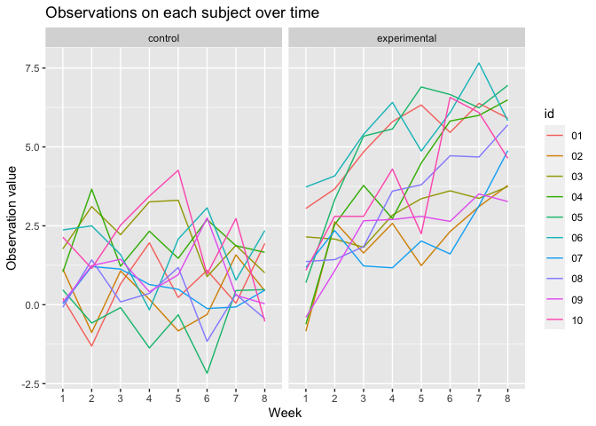

p8105\_hw5\_sc4935
================
Shiwei Chen
11/17/2021

``` r
library(tidyverse)
```

    ## ── Attaching packages ─────────────────────────────────────── tidyverse 1.3.1 ──

    ## ✓ ggplot2 3.3.5     ✓ purrr   0.3.4
    ## ✓ tibble  3.1.4     ✓ dplyr   1.0.7
    ## ✓ tidyr   1.1.3     ✓ stringr 1.4.0
    ## ✓ readr   2.0.1     ✓ forcats 0.5.1

    ## ── Conflicts ────────────────────────────────────────── tidyverse_conflicts() ──
    ## x dplyr::filter() masks stats::filter()
    ## x dplyr::lag()    masks stats::lag()

# Problem 1

Raw data is large and some variables are not cleaned.

### Create a city\_state variable

``` r
homicide_df = read_csv("data/homicide-data.csv") %>% 
  janitor::clean_names() %>% 
  mutate(city_state = str_c(city, state, sep = ", ")) %>% 
  mutate(solved_or_not = if_else(disposition == "Closed without arrest" | disposition == "Open/No arrest", "unsolved", "solved")) 
```

    ## Rows: 52179 Columns: 12

    ## ── Column specification ────────────────────────────────────────────────────────
    ## Delimiter: ","
    ## chr (9): uid, victim_last, victim_first, victim_race, victim_age, victim_sex...
    ## dbl (3): reported_date, lat, lon

    ## 
    ## ℹ Use `spec()` to retrieve the full column specification for this data.
    ## ℹ Specify the column types or set `show_col_types = FALSE` to quiet this message.

``` r
homicide_df
```

    ## # A tibble: 52,179 × 14
    ##    uid        reported_date victim_last  victim_first victim_race victim_age
    ##    <chr>              <dbl> <chr>        <chr>        <chr>       <chr>     
    ##  1 Alb-000001      20100504 GARCIA       JUAN         Hispanic    78        
    ##  2 Alb-000002      20100216 MONTOYA      CAMERON      Hispanic    17        
    ##  3 Alb-000003      20100601 SATTERFIELD  VIVIANA      White       15        
    ##  4 Alb-000004      20100101 MENDIOLA     CARLOS       Hispanic    32        
    ##  5 Alb-000005      20100102 MULA         VIVIAN       White       72        
    ##  6 Alb-000006      20100126 BOOK         GERALDINE    White       91        
    ##  7 Alb-000007      20100127 MALDONADO    DAVID        Hispanic    52        
    ##  8 Alb-000008      20100127 MALDONADO    CONNIE       Hispanic    52        
    ##  9 Alb-000009      20100130 MARTIN-LEYVA GUSTAVO      White       56        
    ## 10 Alb-000010      20100210 HERRERA      ISRAEL       Hispanic    43        
    ## # … with 52,169 more rows, and 8 more variables: victim_sex <chr>, city <chr>,
    ## #   state <chr>, lat <dbl>, lon <dbl>, disposition <chr>, city_state <chr>,
    ## #   solved_or_not <chr>

### Summarize within cities to obtain the total number of homicides and the number of unsolved homicides

``` r
homicide_city = homicide_df %>% 
  count(city_state) %>% 
  rename(total = n)
 
homicide_city
```

    ## # A tibble: 51 × 2
    ##    city_state      total
    ##    <chr>           <int>
    ##  1 Albuquerque, NM   378
    ##  2 Atlanta, GA       973
    ##  3 Baltimore, MD    2827
    ##  4 Baton Rouge, LA   424
    ##  5 Birmingham, AL    800
    ##  6 Boston, MA        614
    ##  7 Buffalo, NY       521
    ##  8 Charlotte, NC     687
    ##  9 Chicago, IL      5535
    ## 10 Cincinnati, OH    694
    ## # … with 41 more rows

``` r
homicide_city_unsolved = homicide_df %>% 
  select(city_state, solved_or_not) %>%
  group_by(city_state) %>% 
  summarise(total_unsolved = sum(solved_or_not == "unsolved")) %>% 
  select(-city_state)
  
homicide_city_unsolved 
```

    ## # A tibble: 51 × 1
    ##    total_unsolved
    ##             <int>
    ##  1            146
    ##  2            373
    ##  3           1825
    ##  4            196
    ##  5            347
    ##  6            310
    ##  7            319
    ##  8            206
    ##  9           4073
    ## 10            309
    ## # … with 41 more rows

``` r
homicide_count = bind_cols(homicide_city, homicide_city_unsolved) %>% 
  view()
homicide_count
```

    ## # A tibble: 51 × 3
    ##    city_state      total total_unsolved
    ##    <chr>           <int>          <int>
    ##  1 Albuquerque, NM   378            146
    ##  2 Atlanta, GA       973            373
    ##  3 Baltimore, MD    2827           1825
    ##  4 Baton Rouge, LA   424            196
    ##  5 Birmingham, AL    800            347
    ##  6 Boston, MA        614            310
    ##  7 Buffalo, NY       521            319
    ##  8 Charlotte, NC     687            206
    ##  9 Chicago, IL      5535           4073
    ## 10 Cincinnati, OH    694            309
    ## # … with 41 more rows

### For the city of Baltimore, MD, use the prop.test function to estimate the proportion of homicides that are unsolved

``` r
prop.test(
  homicide_count %>% filter(city_state == "Baltimore, MD") %>% pull(total_unsolved), 
  homicide_count %>% filter(city_state == "Baltimore, MD") %>% pull(total)
  ) %>% 
  broom::tidy()
```

    ## # A tibble: 1 × 8
    ##   estimate statistic  p.value parameter conf.low conf.high method    alternative
    ##      <dbl>     <dbl>    <dbl>     <int>    <dbl>     <dbl> <chr>     <chr>      
    ## 1    0.646      239. 6.46e-54         1    0.628     0.663 1-sample… two.sided

### Now run prop.test for each of the cities in your dataset, and extract both the proportion of unsolved homicides and the confidence interval for each

``` r
unsolved_prop_city = homicide_count %>% 
  mutate(prop_t = map2(.x = total_unsolved, .y = total, ~prop.test(x = .x, n = .y)), tidy_t = map(.x = prop_t, ~broom::tidy(.x))) %>% 
  unnest(tidy_t) %>% 
  select(city_state, estimate, conf.low, conf.high)
```

    ## Warning in prop.test(x = .x, n = .y): Chi-squared approximation may be incorrect

``` r
unsolved_prop_city
```

    ## # A tibble: 51 × 4
    ##    city_state      estimate conf.low conf.high
    ##    <chr>              <dbl>    <dbl>     <dbl>
    ##  1 Albuquerque, NM    0.386    0.337     0.438
    ##  2 Atlanta, GA        0.383    0.353     0.415
    ##  3 Baltimore, MD      0.646    0.628     0.663
    ##  4 Baton Rouge, LA    0.462    0.414     0.511
    ##  5 Birmingham, AL     0.434    0.399     0.469
    ##  6 Boston, MA         0.505    0.465     0.545
    ##  7 Buffalo, NY        0.612    0.569     0.654
    ##  8 Charlotte, NC      0.300    0.266     0.336
    ##  9 Chicago, IL        0.736    0.724     0.747
    ## 10 Cincinnati, OH     0.445    0.408     0.483
    ## # … with 41 more rows

### Create a plot that shows the estimates and CIs for each city

``` r
unsolved_prop_city %>% 
  mutate(city_state = fct_reorder(city_state, estimate)) %>% 
  ggplot(aes(x = city_state, y = estimate)) +
  geom_point() + 
  geom_errorbar(aes(ymin = conf.low, ymax = conf.high)) + 
  theme(axis.text.x = element_text(angle = 90, vjust = 0.5, hjust = 1)) +
  labs(
    title = "The estimates and CIs for each city",
    x = "City of state",
    y = "Estimate rate",
    caption = "Data from homicide-data.csv"
  )
```

<!-- -->

# Problem 2

### Start with a dataframe containing all file names

``` r
path_df = tibble(path = list.files("data/data_p2/")) %>% 
  mutate(path = str_c("data/data_p2/", path), data = map(.x = path, read_csv))
```

    ## Rows: 1 Columns: 8

    ## ── Column specification ────────────────────────────────────────────────────────
    ## Delimiter: ","
    ## dbl (8): week_1, week_2, week_3, week_4, week_5, week_6, week_7, week_8

    ## 
    ## ℹ Use `spec()` to retrieve the full column specification for this data.
    ## ℹ Specify the column types or set `show_col_types = FALSE` to quiet this message.

    ## Rows: 1 Columns: 8

    ## ── Column specification ────────────────────────────────────────────────────────
    ## Delimiter: ","
    ## dbl (8): week_1, week_2, week_3, week_4, week_5, week_6, week_7, week_8

    ## 
    ## ℹ Use `spec()` to retrieve the full column specification for this data.
    ## ℹ Specify the column types or set `show_col_types = FALSE` to quiet this message.

    ## Rows: 1 Columns: 8

    ## ── Column specification ────────────────────────────────────────────────────────
    ## Delimiter: ","
    ## dbl (8): week_1, week_2, week_3, week_4, week_5, week_6, week_7, week_8

    ## 
    ## ℹ Use `spec()` to retrieve the full column specification for this data.
    ## ℹ Specify the column types or set `show_col_types = FALSE` to quiet this message.

    ## Rows: 1 Columns: 8

    ## ── Column specification ────────────────────────────────────────────────────────
    ## Delimiter: ","
    ## dbl (8): week_1, week_2, week_3, week_4, week_5, week_6, week_7, week_8

    ## 
    ## ℹ Use `spec()` to retrieve the full column specification for this data.
    ## ℹ Specify the column types or set `show_col_types = FALSE` to quiet this message.

    ## Rows: 1 Columns: 8

    ## ── Column specification ────────────────────────────────────────────────────────
    ## Delimiter: ","
    ## dbl (8): week_1, week_2, week_3, week_4, week_5, week_6, week_7, week_8

    ## 
    ## ℹ Use `spec()` to retrieve the full column specification for this data.
    ## ℹ Specify the column types or set `show_col_types = FALSE` to quiet this message.

    ## Rows: 1 Columns: 8

    ## ── Column specification ────────────────────────────────────────────────────────
    ## Delimiter: ","
    ## dbl (8): week_1, week_2, week_3, week_4, week_5, week_6, week_7, week_8

    ## 
    ## ℹ Use `spec()` to retrieve the full column specification for this data.
    ## ℹ Specify the column types or set `show_col_types = FALSE` to quiet this message.

    ## Rows: 1 Columns: 8

    ## ── Column specification ────────────────────────────────────────────────────────
    ## Delimiter: ","
    ## dbl (8): week_1, week_2, week_3, week_4, week_5, week_6, week_7, week_8

    ## 
    ## ℹ Use `spec()` to retrieve the full column specification for this data.
    ## ℹ Specify the column types or set `show_col_types = FALSE` to quiet this message.

    ## Rows: 1 Columns: 8

    ## ── Column specification ────────────────────────────────────────────────────────
    ## Delimiter: ","
    ## dbl (8): week_1, week_2, week_3, week_4, week_5, week_6, week_7, week_8

    ## 
    ## ℹ Use `spec()` to retrieve the full column specification for this data.
    ## ℹ Specify the column types or set `show_col_types = FALSE` to quiet this message.

    ## Rows: 1 Columns: 8

    ## ── Column specification ────────────────────────────────────────────────────────
    ## Delimiter: ","
    ## dbl (8): week_1, week_2, week_3, week_4, week_5, week_6, week_7, week_8

    ## 
    ## ℹ Use `spec()` to retrieve the full column specification for this data.
    ## ℹ Specify the column types or set `show_col_types = FALSE` to quiet this message.

    ## Rows: 1 Columns: 8

    ## ── Column specification ────────────────────────────────────────────────────────
    ## Delimiter: ","
    ## dbl (8): week_1, week_2, week_3, week_4, week_5, week_6, week_7, week_8

    ## 
    ## ℹ Use `spec()` to retrieve the full column specification for this data.
    ## ℹ Specify the column types or set `show_col_types = FALSE` to quiet this message.

    ## Rows: 1 Columns: 8

    ## ── Column specification ────────────────────────────────────────────────────────
    ## Delimiter: ","
    ## dbl (8): week_1, week_2, week_3, week_4, week_5, week_6, week_7, week_8

    ## 
    ## ℹ Use `spec()` to retrieve the full column specification for this data.
    ## ℹ Specify the column types or set `show_col_types = FALSE` to quiet this message.

    ## Rows: 1 Columns: 8

    ## ── Column specification ────────────────────────────────────────────────────────
    ## Delimiter: ","
    ## dbl (8): week_1, week_2, week_3, week_4, week_5, week_6, week_7, week_8

    ## 
    ## ℹ Use `spec()` to retrieve the full column specification for this data.
    ## ℹ Specify the column types or set `show_col_types = FALSE` to quiet this message.

    ## Rows: 1 Columns: 8

    ## ── Column specification ────────────────────────────────────────────────────────
    ## Delimiter: ","
    ## dbl (8): week_1, week_2, week_3, week_4, week_5, week_6, week_7, week_8

    ## 
    ## ℹ Use `spec()` to retrieve the full column specification for this data.
    ## ℹ Specify the column types or set `show_col_types = FALSE` to quiet this message.

    ## Rows: 1 Columns: 8

    ## ── Column specification ────────────────────────────────────────────────────────
    ## Delimiter: ","
    ## dbl (8): week_1, week_2, week_3, week_4, week_5, week_6, week_7, week_8

    ## 
    ## ℹ Use `spec()` to retrieve the full column specification for this data.
    ## ℹ Specify the column types or set `show_col_types = FALSE` to quiet this message.

    ## Rows: 1 Columns: 8

    ## ── Column specification ────────────────────────────────────────────────────────
    ## Delimiter: ","
    ## dbl (8): week_1, week_2, week_3, week_4, week_5, week_6, week_7, week_8

    ## 
    ## ℹ Use `spec()` to retrieve the full column specification for this data.
    ## ℹ Specify the column types or set `show_col_types = FALSE` to quiet this message.

    ## Rows: 1 Columns: 8

    ## ── Column specification ────────────────────────────────────────────────────────
    ## Delimiter: ","
    ## dbl (8): week_1, week_2, week_3, week_4, week_5, week_6, week_7, week_8

    ## 
    ## ℹ Use `spec()` to retrieve the full column specification for this data.
    ## ℹ Specify the column types or set `show_col_types = FALSE` to quiet this message.

    ## Rows: 1 Columns: 8

    ## ── Column specification ────────────────────────────────────────────────────────
    ## Delimiter: ","
    ## dbl (8): week_1, week_2, week_3, week_4, week_5, week_6, week_7, week_8

    ## 
    ## ℹ Use `spec()` to retrieve the full column specification for this data.
    ## ℹ Specify the column types or set `show_col_types = FALSE` to quiet this message.

    ## Rows: 1 Columns: 8

    ## ── Column specification ────────────────────────────────────────────────────────
    ## Delimiter: ","
    ## dbl (8): week_1, week_2, week_3, week_4, week_5, week_6, week_7, week_8

    ## 
    ## ℹ Use `spec()` to retrieve the full column specification for this data.
    ## ℹ Specify the column types or set `show_col_types = FALSE` to quiet this message.

    ## Rows: 1 Columns: 8

    ## ── Column specification ────────────────────────────────────────────────────────
    ## Delimiter: ","
    ## dbl (8): week_1, week_2, week_3, week_4, week_5, week_6, week_7, week_8

    ## 
    ## ℹ Use `spec()` to retrieve the full column specification for this data.
    ## ℹ Specify the column types or set `show_col_types = FALSE` to quiet this message.

    ## Rows: 1 Columns: 8

    ## ── Column specification ────────────────────────────────────────────────────────
    ## Delimiter: ","
    ## dbl (8): week_1, week_2, week_3, week_4, week_5, week_6, week_7, week_8

    ## 
    ## ℹ Use `spec()` to retrieve the full column specification for this data.
    ## ℹ Specify the column types or set `show_col_types = FALSE` to quiet this message.

``` r
read_csv(path_df$path[[20]])
```

    ## Rows: 1 Columns: 8

    ## ── Column specification ────────────────────────────────────────────────────────
    ## Delimiter: ","
    ## dbl (8): week_1, week_2, week_3, week_4, week_5, week_6, week_7, week_8

    ## 
    ## ℹ Use `spec()` to retrieve the full column specification for this data.
    ## ℹ Specify the column types or set `show_col_types = FALSE` to quiet this message.

    ## # A tibble: 1 × 8
    ##   week_1 week_2 week_3 week_4 week_5 week_6 week_7 week_8
    ##    <dbl>  <dbl>  <dbl>  <dbl>  <dbl>  <dbl>  <dbl>  <dbl>
    ## 1   1.09    2.8    2.8    4.3   2.25   6.57   6.09   4.64

``` r
research_df = bind_rows(path_df) %>% 
  unnest(data)

research_df
```

    ## # A tibble: 20 × 9
    ##    path                  week_1 week_2 week_3 week_4 week_5 week_6 week_7 week_8
    ##    <chr>                  <dbl>  <dbl>  <dbl>  <dbl>  <dbl>  <dbl>  <dbl>  <dbl>
    ##  1 data/data_p2/con_01.…   0.2   -1.31   0.66   1.96   0.23   1.09   0.05   1.94
    ##  2 data/data_p2/con_02.…   1.13  -0.88   1.07   0.17  -0.83  -0.31   1.58   0.44
    ##  3 data/data_p2/con_03.…   1.77   3.11   2.22   3.26   3.31   0.89   1.88   1.01
    ##  4 data/data_p2/con_04.…   1.04   3.66   1.22   2.33   1.47   2.7    1.87   1.66
    ##  5 data/data_p2/con_05.…   0.47  -0.58  -0.09  -1.37  -0.32  -2.17   0.45   0.48
    ##  6 data/data_p2/con_06.…   2.37   2.5    1.59  -0.16   2.08   3.07   0.78   2.35
    ##  7 data/data_p2/con_07.…   0.03   1.21   1.13   0.64   0.49  -0.12  -0.07   0.46
    ##  8 data/data_p2/con_08.…  -0.08   1.42   0.09   0.36   1.18  -1.16   0.33  -0.44
    ##  9 data/data_p2/con_09.…   0.08   1.24   1.44   0.41   0.95   2.75   0.3    0.03
    ## 10 data/data_p2/con_10.…   2.14   1.15   2.52   3.44   4.26   0.97   2.73  -0.53
    ## 11 data/data_p2/exp_01.…   3.05   3.67   4.84   5.8    6.33   5.46   6.38   5.91
    ## 12 data/data_p2/exp_02.…  -0.84   2.63   1.64   2.58   1.24   2.32   3.11   3.78
    ## 13 data/data_p2/exp_03.…   2.15   2.08   1.82   2.84   3.36   3.61   3.37   3.74
    ## 14 data/data_p2/exp_04.…  -0.62   2.54   3.78   2.73   4.49   5.82   6      6.49
    ## 15 data/data_p2/exp_05.…   0.7    3.33   5.34   5.57   6.9    6.66   6.24   6.95
    ## 16 data/data_p2/exp_06.…   3.73   4.08   5.4    6.41   4.87   6.09   7.66   5.83
    ## 17 data/data_p2/exp_07.…   1.18   2.35   1.23   1.17   2.02   1.61   3.13   4.88
    ## 18 data/data_p2/exp_08.…   1.37   1.43   1.84   3.6    3.8    4.72   4.68   5.7 
    ## 19 data/data_p2/exp_09.…  -0.4    1.08   2.66   2.7    2.8    2.64   3.51   3.27
    ## 20 data/data_p2/exp_10.…   1.09   2.8    2.8    4.3    2.25   6.57   6.09   4.64

### Tidy the result

``` r
research_tidy = research_df %>% 
  rename(arm_type = path) %>% 
  mutate(arm_type = str_replace(arm_type, "data/data_p2/", "")) %>% 
  mutate(arm_type = str_replace(arm_type, ".csv", "")) %>% 
  pivot_longer(
    week_1:week_8,
    names_to = "week",
    values_to = "observations") %>% 
  mutate(week = str_replace(week, "week_", "")) %>% 
  separate(arm_type, into = c("arm", "id"), sep = "_") %>% 
  mutate(arm = recode(arm, "con" = "control", "exp" = "experimental")) %>% 
  arrange(arm, id, week) 
  
research_tidy
```

    ## # A tibble: 160 × 4
    ##    arm     id    week  observations
    ##    <chr>   <chr> <chr>        <dbl>
    ##  1 control 01    1             0.2 
    ##  2 control 01    2            -1.31
    ##  3 control 01    3             0.66
    ##  4 control 01    4             1.96
    ##  5 control 01    5             0.23
    ##  6 control 01    6             1.09
    ##  7 control 01    7             0.05
    ##  8 control 01    8             1.94
    ##  9 control 02    1             1.13
    ## 10 control 02    2            -0.88
    ## # … with 150 more rows

### Make a spaghetti plot showing observations on each subject over time

``` r
ggplot(research_tidy, aes(x = week, y = observations, color = id, group = id)) +
  geom_line() + facet_grid(. ~ arm) +
  labs(
    title = "Observations on each subject over time",
    x = "Week",
    y = "Observation value"
  )
```

<!-- -->

### Comment on differences between groups

Compare the experimental group to the control group, the trend of the
experimental group shows strong positive correlation(observations of
each subject increase over time) for the observations on each subject
over time. For the trend of the control group, the plot indicates very
weak correlation for the observations on each subject over time.

# Problem 3

Load the iris dataset

``` r
set.seed(10)

iris_with_missing = iris %>% 
  map_df(~replace(.x, sample(1:150, 20), NA)) %>%
  mutate(Species = as.character(Species)) 

iris_with_missing
```

    ## # A tibble: 150 × 5
    ##    Sepal.Length Sepal.Width Petal.Length Petal.Width Species
    ##           <dbl>       <dbl>        <dbl>       <dbl> <chr>  
    ##  1          5.1         3.5          1.4         0.2 setosa 
    ##  2          4.9         3            1.4         0.2 setosa 
    ##  3          4.7         3.2          1.3         0.2 setosa 
    ##  4          4.6         3.1          1.5        NA   setosa 
    ##  5          5           3.6          1.4         0.2 setosa 
    ##  6          5.4         3.9          1.7         0.4 setosa 
    ##  7         NA           3.4          1.4         0.3 setosa 
    ##  8          5           3.4          1.5         0.2 setosa 
    ##  9          4.4         2.9          1.4         0.2 setosa 
    ## 10          4.9         3.1         NA           0.1 setosa 
    ## # … with 140 more rows

Write two cases of functions

``` r
iris_wo_missing = function(vec) {
  if (is.numeric(vec)) {
    replace_na(vec, round(mean(vec, na.rm = TRUE), digits = 1))
    }
  else if (is.character(vec)) {
    replace_na(vec, "virginica")
    }
} 
```

### Apply this function to the columns of iris\_with\_missing using a map statement

``` r
map_df(iris_with_missing, iris_wo_missing) 
```

    ## # A tibble: 150 × 5
    ##    Sepal.Length Sepal.Width Petal.Length Petal.Width Species
    ##           <dbl>       <dbl>        <dbl>       <dbl> <chr>  
    ##  1          5.1         3.5          1.4         0.2 setosa 
    ##  2          4.9         3            1.4         0.2 setosa 
    ##  3          4.7         3.2          1.3         0.2 setosa 
    ##  4          4.6         3.1          1.5         1.2 setosa 
    ##  5          5           3.6          1.4         0.2 setosa 
    ##  6          5.4         3.9          1.7         0.4 setosa 
    ##  7          5.8         3.4          1.4         0.3 setosa 
    ##  8          5           3.4          1.5         0.2 setosa 
    ##  9          4.4         2.9          1.4         0.2 setosa 
    ## 10          4.9         3.1          3.8         0.1 setosa 
    ## # … with 140 more rows
